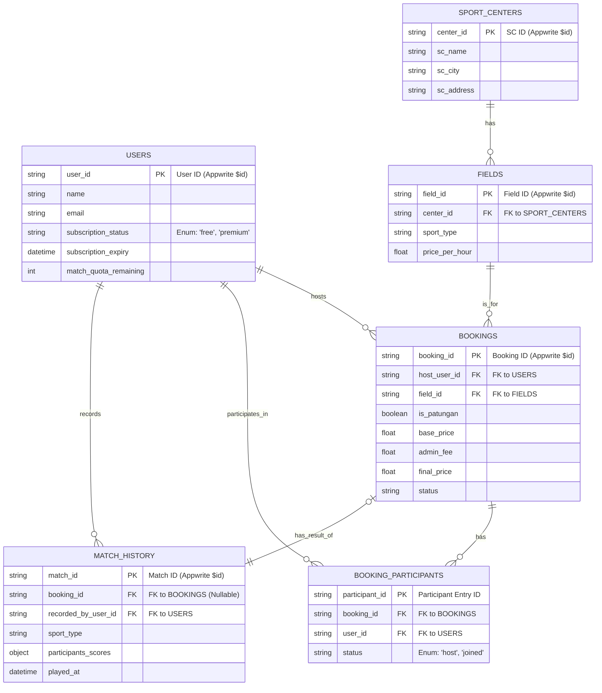

# **Entity-Relationship Diagram (ERD): Gsports v1.0**

| **Status Dokumen** | Draft                                        |
| ------------------ | -------------------------------------------- |
| **Versi Dokumen**  | 1.0                                          |
| **Tanggal**        | 5 November 2025                              |
| **Penyusun**       | Ahmad Rois (221240001239) M. Gilang M.W. Sabd
---
*   **Nama Produk:** Gsports
*   **Tujuan:** Dokumen ini menyediakan representasi visual dan deskripsi detail dari model data untuk aplikasi Gsports v2.0. Ini berfungsi sebagai cetak biru untuk pembuatan dan pengelolaan koleksi (collections) di database Appwrite.

## **1. Gambaran Umum Model Data**

Model data Gsports v2.0 dirancang untuk mendukung ekosistem aplikasi yang diperluas, mencakup pemesanan, interaksi sosial (patungan), dan utilitas permainan (papan skor). Meskipun diimplementasikan pada database NoSQL (Appwrite), model ini dirancang dengan prinsip relasional yang jelas untuk memastikan integritas dan skalabilitas data.

Diagram di bawah ini mengilustrasikan entitas-entitas utama dan hubungan antar mereka.

## **2. ER Diagram**

## **3. Definisi Entitas (Data Dictionary)**

### **3.1. Entitas: `USERS`**
Menyimpan data semua pengguna yang terdaftar, termasuk status langganan dan kuota fitur.

| Atribut | Tipe Data | Deskripsi | Kendala & Catatan |
| :--- | :--- | :--- | :--- |
| **user_id** | `string` | ID unik untuk setiap pengguna, disediakan oleh Appwrite (`$id`). | **Primary Key (PK)** |
| name | `string` | Nama lengkap pengguna. | Wajib (Not Null) |
| email | `string` | Alamat email pengguna, digunakan untuk login. | Wajib, Unik, Indexed |
| subscription_status | `string` | Status langganan pengguna untuk fitur premium (papan skor). | Enum: `'free'`, `'premium'`. Default: `'free'`. |
| subscription_expiry | `datetime`| Tanggal dan waktu kedaluwarsa langganan premium. | Nullable (hanya diisi jika status `premium`). |
| match_quota_remaining | `int` | Jumlah sisa kuota penggunaan papan skor untuk pengguna gratis. | Default: `5`. Hanya relevan jika status `free`. |

### **3.2. Entitas: `SPORT_CENTERS`**
Menyimpan data setiap Sports Center (tenant) yang terdaftar di platform.

| Atribut | Tipe Data | Deskripsi | Kendala & Catatan |
| :--- | :--- | :--- | :--- |
| **center_id** | `string` | ID unik untuk setiap SC, disediakan oleh Appwrite (`$id`). | **Primary Key (PK)** |
| sc_name | `string` | Nama resmi Sports Center. | Wajib, Indexed |
| sc_city | `string` | Kota lokasi SC, digunakan untuk filter pencarian. | Wajib, Indexed |
| sc_address | `string` | Alamat lengkap SC. | Wajib |

### **3.3. Entitas: `FIELDS`**
Menyimpan data setiap lapangan yang dimiliki oleh sebuah Sports Center.

| Atribut | Tipe Data | Deskripsi | Kendala & Catatan |
| :--- | :--- | :--- | :--- |
| **field_id** | `string` | ID unik untuk setiap lapangan, disediakan oleh Appwrite (`$id`). | **Primary Key (PK)** |
| center_id | `string` | ID SC pemilik lapangan ini. | **Foreign Key (FK)** ke `SPORT_CENTERS.center_id`, Wajib, Indexed |
| sport_type | `string` | Jenis olahraga utama lapangan (misal: 'futsal', 'badminton'). | Wajib, Indexed |
| price_per_hour | `float` | Harga sewa lapangan per jam dalam mata uang lokal. | Wajib, > 0 |

### **3.4. Entitas: `BOOKINGS`**
Entitas inti yang menyimpan setiap transaksi pemesanan lapangan.

| Atribut | Tipe Data | Deskripsi | Kendala & Catatan |
| :--- | :--- | :--- | :--- |
| **booking_id** | `string` | ID unik untuk setiap pemesanan. | **Primary Key (PK)** |
| host_user_id | `string` | ID pengguna yang memulai dan membayar pemesanan. | **Foreign Key (FK)** ke `USERS.user_id`, Wajib, Indexed |
| field_id | `string` | ID lapangan yang dipesan. | **Foreign Key (FK)** ke `FIELDS.field_id`, Wajib, Indexed |
| is_patungan | `boolean` | Menandakan apakah pemesanan ini adalah sesi patungan. | Default: `false` |
| base_price | `float` | Harga asli sewa lapangan sebelum biaya tambahan. | Wajib |
| admin_fee | `float` | Biaya layanan yang dikenakan oleh platform Gsports. | Wajib |
| final_price | `float` | Total harga yang dibayar oleh Host (`base_price` + `admin_fee`). | Wajib |
| status | `string` | Status pemesanan saat ini. | Enum: `'pending_payment'`, `'confirmed'`, `'cancelled'`, `'completed'`. Indexed. |

### **3.5. Entitas: `BOOKING_PARTICIPANTS`**
Tabel penghubung untuk melacak semua pengguna yang bergabung dalam satu sesi booking patungan.

| Atribut | Tipe Data | Deskripsi | Kendala & Catatan |
| :--- | :--- | :--- | :--- |
| **participant_id**| `string` | ID unik untuk setiap entri partisipasi. | **Primary Key (PK)** |
| booking_id | `string` | ID pemesanan yang diikuti. | **Foreign Key (FK)** ke `BOOKINGS.booking_id`, Wajib, Indexed |
| user_id | `string` | ID pengguna yang bergabung. | **Foreign Key (FK)** ke `USERS.user_id`, Wajib, Indexed |
| status | `string` | Peran pengguna dalam booking ini. | Enum: `'host'`, `'joined'`. |

### **3.6. Entitas: `MATCH_HISTORY`**
Menyimpan data setiap pertandingan yang dicatat menggunakan fitur papan skor "SEKOR".

| Atribut | Tipe Data | Deskripsi | Kendala & Catatan |
| :--- | :--- | :--- | :--- |
| **match_id** | `string` | ID unik untuk setiap riwayat pertandingan. | **Primary Key (PK)** |
| booking_id | `string` | ID pemesanan terkait. Null jika papan skor digunakan standalone. | **Foreign Key (FK)** ke `BOOKINGS.booking_id`, Nullable, Indexed |
| recorded_by_user_id| `string` | ID pengguna yang mencatat dan menyimpan pertandingan ini. | **Foreign Key (FK)** ke `USERS.user_id`, Wajib, Indexed |
| sport_type | `string` | Jenis olahraga dari pertandingan yang dicatat. | Wajib |
| participants_scores| `object` | Objek JSON yang menyimpan detail nama tim dan skor akhir. | Contoh: `{"teamA": {"name": "Alpha", "score": 21}, "teamB": {"name": "Bravo", "score": 19}}` |
| played_at | `datetime`| Tanggal dan waktu pertandingan selesai. | Wajib |

## **4. Penjelasan Hubungan (Relationships)**

*   **USERS dan BOOKINGS (One-to-Many):** Satu `USER` dapat bertindak sebagai `Host` untuk banyak `BOOKINGS`.
*   **USERS dan BOOKING_PARTICIPANTS (One-to-Many):** Satu `USER` dapat berpartisipasi di banyak booking yang berbeda.
*   **BOOKINGS dan BOOKING_PARTICIPANTS (One-to-Many):** Satu `BOOKING` (jika `is_patungan` = true) dapat memiliki banyak `BOOKING_PARTICIPANTS`, termasuk Host.
*   **SPORT_CENTERS dan FIELDS (One-to-Many):** Satu `SPORT_CENTER` dapat memiliki banyak `FIELDS`.
*   **FIELDS dan BOOKINGS (One-to-Many):** Satu `FIELD` dapat memiliki banyak `BOOKINGS` pada waktu yang berbeda.
*   **USERS dan MATCH_HISTORY (One-to-Many):** Satu `USER` yang login dapat mencatat dan menyimpan banyak `MATCH_HISTORY`.
*   **BOOKINGS dan MATCH_HISTORY (One-to-Zero-or-One):** Sebuah `BOOKING` dapat memiliki satu (atau tidak sama sekali) entri `MATCH_HISTORY` yang terkait dengannya. Hubungan ini bersifat opsional (`Nullable`), memungkinkan `MATCH_HISTORY` untuk ada secara mandiri (standalone).