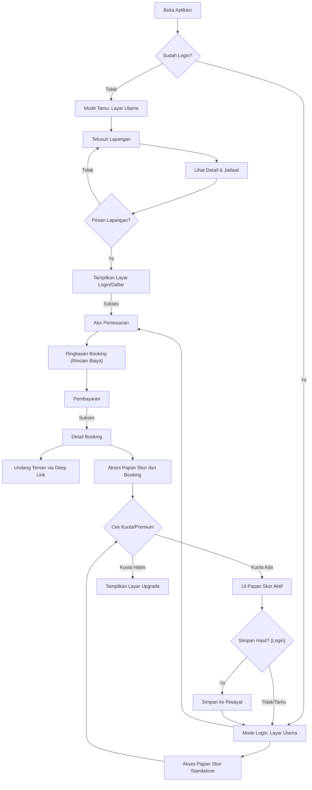

# **Product Requirements Document (PRD): Gsports v2.0**
### **"Dari Alat Pesan Menjadi Komunitas Bermain"**

**Nama Produk:** Gsports
**Versi:** 1.0
**Tanggal:** 5 November 2025
| **Status Dokumen** | Draft                                        |
| ------------------ | -------------------------------------------- |
| **Versi Dokumen**  | 1.0                                          |
| **Tanggal**        | 5 November 2025                              |
| **Penyusun**       | Ahmad Rois (221240001239) M. Gilang M.W. Sabd
---

## **1. Ringkasan Eksekutif (Executive Summary)**

**Gsports v2.0** menandai evolusi strategis dari aplikasi pemesanan lapangan menjadi sebuah platform komunitas olahraga yang terintegrasi. Rilis ini mengatasi tiga tantangan utama: **friksi bagi pengguna baru**, **kesulitan koordinasi permainan grup**, dan **kurangnya keterlibatan (engagement) pasca-pemesanan**.

Kami akan memperkenalkan **Mode Tamu** yang memungkinkan eksplorasi tanpa registrasi, fitur **Pemesanan Patungan** untuk menyederhanakan permainan grup, dan mengintegrasikan papan skor digital **"SEKOR"** sebagai utilitas bernilai tinggi. Model bisnis akan diperluas dengan **Biaya Layanan** transparan pada setiap booking dan model **Freemium** untuk fitur papan skor, menciptakan aliran pendapatan baru sambil meningkatkan nilai produk secara signifikan.

## **2. Latar Belakang & Masalah (The Problem)**

Analisis penggunaan Gsports v1.1 menunjukkan beberapa peluang pertumbuhan yang terhambat oleh keterbatasan produk saat ini:

1.  **Hambatan Masuk yang Tinggi (High Barrier to Entry):** Kewajiban untuk mendaftar sebelum melihat nilai produk (ketersediaan lapangan) menyebabkan calon pengguna potensial meninggalkan aplikasi. *Problem: "Saya tidak mau membuat akun hanya untuk 'melihat-lihat'."*
2.  **Beban Koordinasi Grup:** Pengguna yang memesan lapangan untuk grup harus melakukan koordinasi (mengajak, mengingatkan, mencatat siapa saja yang ikut) di luar aplikasi (misal: grup WhatsApp). Ini tidak efisien dan memutus alur. *Problem: "Sulit melacak siapa saja yang akan ikut bermain di booking saya."*
3.  **Keterlibatan Sesaat (Low Engagement):** Setelah pemesanan berhasil, tidak ada alasan bagi pengguna untuk membuka kembali aplikasi hingga hari permainan. Ini membatasi peluang untuk membangun loyalitas dan komunitas. *Problem: "Aplikasi ini hanya berguna saat saya mau pesan lapangan saja."*
4.  **Ketergantungan pada Satu Aliran Pendapatan:** Model bisnis yang hanya bergantung pada kerjasama dengan SC (jika ada) tidak terdiversifikasi. *Problem: "Bagaimana platform bisa tumbuh secara finansial?"*

## **3. Visi & Strategi Produk**

**Visi:** Menjadi aplikasi super (*super-app*) untuk komunitas olahraga rekreasi, memfasilitasi setiap tahap dari pencarian, pemesanan, permainan, hingga interaksi pasca-pertandingan.

**Strategi v2.0:**
1.  **Akuisisi & Aktivasi:** Menurunkan friksi secara drastis dengan Mode Tamu untuk meningkatkan jumlah unduhan dan pengguna aktif.
2.  **Engagement & Retensi:** Meningkatkan "kelengketan" aplikasi dengan menyediakan utilitas yang berguna di luar pemesanan (papan skor) dan memfasilitasi interaksi sosial (patungan).
3.  **Monetisasi:** Memperkenalkan dua aliran pendapatan baru (Biaya Layanan dan Langganan Premium) yang selaras dengan nilai yang diberikan kepada pengguna.

## **4. Tujuan & Metrik Keberhasilan (Goals & Success Metrics)**

| Kategori | Tujuan | Metrik Kunci (KPI) | Target (3 Bulan Pasca-Peluncuran) |
| :--- | :--- | :--- | :--- |
| **Aktivasi & Konversi** | Mengurangi hambatan masuk dan mengubah pengunjung menjadi pengguna terdaftar. | - Tingkat Konversi Tamu ke Registrasi - Waktu Rata-rata dari Instal ke Booking Pertama | - Konversi > 15% - Mengurangi waktu hingga 20% |
| **Engagement** | Meningkatkan frekuensi dan durasi penggunaan aplikasi. | - Jumlah Pertandingan yang Dicatat (via SEKOR) per Pengguna Aktif - % Booking yang Menggunakan Fitur Patungan | - > 1 pertandingan/user/bulan - > 10% dari semua booking |
| **Retensi** | Membuat pengguna kembali ke aplikasi secara teratur. | - Tingkat Retensi Hari ke-7 (D7 Retention) - Tingkat Retensi Hari ke-30 (D30 Retention) | - D7 > 25% - D30 > 10% |
| **Monetisasi** | Memvalidasi model pendapatan baru. | - Total Pendapatan dari Biaya Layanan - Tingkat Konversi dari Gratis ke Premium (CTR pada tombol upgrade) | - Membangun baseline pendapatan - CTR > 2% |

## **5. Target Audiens (User Personas)**

*   **Persona Primer: "Rian, si Inisiator"** (Evolusi dari "Budi")
    *   **Profil:** Karyawan, 29 tahun. Dialah yang biasanya berinisiatif mengajak teman-temannya bermain.
    *   **Motivasi:** Mencari cara termudah untuk mengecek lapangan, memesan, dan mengelola siapa saja yang akan ikut tanpa harus repot di grup WhatsApp.
    *   **Frustrasi:** "Repot banget harus nanya satu-satu siapa yang fix ikut. Kadang ada yang batal mendadak."

*   **Persona Sekunder: "Dina, si Penjelajah"** (Pengguna Baru)
    *   **Profil:** Mahasiswi, 21 tahun. Baru pindah ke kota baru dan mencari tempat olahraga.
    *   **Motivasi:** Ingin melihat pilihan lapangan dan harga di sekitarnya sebelum memutuskan untuk membuat akun.
    *   **Frustrasi:** "Malas ah, disuruh daftar dulu padahal cuma mau lihat-lihat."

## **6. Persyaratan Fungsional (Functional Requirements)**

### **6.1 Fitur: Pengalaman Pengguna Baru & Onboarding**

| ID | Persyaratan | User Story / Rationale | Prioritas | Kriteria Penerimaan (Acceptance Criteria) |
| :--- | :--- | :--- | :--- | :--- |
| **FT-201** | **Mode Tamu (Guest Browsing)** | Sebagai pengunjung baru, saya ingin bisa langsung menjelajahi daftar lapangan dan melihat jadwal ketersediaan tanpa paksaan untuk mendaftar. | **Must-Have** | 1. Saat aplikasi dibuka pertama kali, pengguna langsung masuk ke layar utama. 2. Pengguna dapat melakukan pencarian, melihat detail SC, dan memeriksa jadwal ketersediaan. |
| **FT-202** | **Otentikasi Saat Dibutuhkan** | Sebagai pengguna tamu, saat saya memutuskan untuk memesan lapangan, saya ingin proses login/daftar muncul secara kontekstual. | **Must-Have** | 1. Tombol "Pesan Sekarang" atau sejenisnya akan memicu munculnya layar/dialog otentikasi. 2. Setelah login/daftar berhasil, aplikasi harus mengembalikan saya ke alur pemesanan yang tadi saya mulai. |

### **6.2 Fitur: Pemesanan Sosial (Patungan)**

| ID | Persyaratan | User Story / Rationale | Prioritas | Kriteria Penerimaan (Acceptance Criteria) |
| :--- | :--- | :--- | :--- | :--- |
| **FT-203** | **Alur Pemesanan Patungan (Host)** | Sebagai Host, saya ingin proses pemesanan berjalan seperti biasa, namun saya bertanggung jawab penuh atas pembayaran di muka. | **Must-Have** | 1. Di alur pemesanan, terdapat opsi (misal: checkbox) "Ajak Teman (Patungan)". 2. Host melanjutkan ke pembayaran dan membayar 100% dari total biaya. 3. Booking yang berhasil akan ditandai sebagai "Booking Patungan". |
| **FT-204** | **Undang Peserta** | Sebagai Host, setelah booking terkonfirmasi, saya ingin ada cara mudah untuk mengundang teman-teman saya, seperti membagikan tautan. | **Must-Have** | 1. Di halaman detail booking, terdapat tombol "Undang Peserta". 2. Menekan tombol akan men-generate deep link unik yang bisa disalin dan dibagikan. |
| **FT-205** | **Bergabung sebagai Peserta** | Sebagai teman yang diundang, saya ingin bisa dengan mudah bergabung ke dalam sesi permainan setelah membuka tautan undangan. | **Must-Have** | 1. Membuka deep link akan mengarahkan pengguna ke halaman detail booking di aplikasi. 2. Jika belum login, pengguna akan diminta login/daftar terlebih dahulu. 3. Terdapat tombol "Gabung" yang jelas. 4. Daftar nama peserta yang sudah bergabung akan tampil di halaman detail booking. |

### **6.3 Fitur: Integrasi & Monetisasi Papan Skor (SEKOR)**

| ID | Persyaratan | User Story / Rationale | Prioritas | Kriteria Penerimaan (Acceptance Criteria) |
| :--- | :--- | :--- | :--- | :--- |
| **FT-206** | **Akses Papan Skor Mandiri** | Sebagai pemain, saya ingin bisa menggunakan papan skor kapan saja untuk pertandingan informal, tanpa harus terikat dengan booking. | **Must-Have** | 1. Terdapat ikon atau menu yang jelas di navigasi utama untuk mengakses Papan Skor. 2. Pengguna dapat langsung setup pertandingan (nama tim, jenis olahraga) dan mulai mencatat skor. |
| **FT-207** | **Simpan Riwayat Pertandingan** | Sebagai pengguna yang login, saya ingin bisa menyimpan hasil akhir pertandingan ke profil saya untuk kenang-kenangan atau referensi. | **Must-Have** | 1. Tombol "Simpan Hasil" hanya aktif/terlihat untuk pengguna yang sudah login. 2. Hasil yang tersimpan akan muncul di halaman "Riwayat Pertandingan" pengguna. |
| **FT-208** | **Manajemen Kuota Gratis** | Sebagai pengguna baru, saya mengerti bahwa saya bisa mencoba fitur papan skor beberapa kali secara gratis sebelum memutuskan untuk berlangganan. | **Must-Have** | 1. Pengguna baru secara default mendapatkan 5 kuota penggunaan papan skor. 2. Setiap kali pengguna login menyimpan hasil, kuota berkurang satu. 3. Logika pengecekan dan pengurangan kuota terjadi di sisi server. |
| **FT-209** | **Alur Peningkatan ke Premium** | Sebagai pengguna yang kehabisan kuota, saya ingin tahu apa keuntungan menjadi premium dan bagaimana cara mendapatkannya. | **Should-Have** | 1. Ketika mencoba menyimpan hasil dengan kuota 0, sebuah dialog akan muncul. 2. Dialog berisi pesan "Kuota gratis habis!" dan tombol "Upgrade ke Premium". 3. Tombol akan mengarahkan ke halaman informasi statis yang menjelaskan benefit premium (skor tak terbatas, fitur eksklusif di masa depan, dll). |

### **6.4 Fitur: Model Bisnis & Transparansi**

| ID | Persyaratan | User Story / Rationale | Prioritas | Kriteria Penerimaan (Acceptance Criteria) |
| :--- | :--- | :--- | :--- | :--- |
| **FT-210** | **Transparansi Biaya Layanan** | Sebagai pengguna, saya ingin melihat rincian biaya yang jelas sebelum membayar agar tidak ada biaya tersembunyi. | **Must-Have** | 1. Di halaman ringkasan pemesanan, ditampilkan secara terpisah: `Harga Sewa Lapangan`, `Biaya Layanan`, dan `Total Pembayaran`. 2. Terdapat ikon info (?) kecil di sebelah "Biaya Layanan" yang menjelaskan fungsinya. |

## **7. Diagram Alur Pengguna (User Flow)**

## **8. Persyaratan Non-Fungsional**

| Kategori | Persyaratan |
| :--- | :--- |
| **Kinerja** | - Transisi dari mode tamu ke alur pemesanan setelah login harus terasa instan dan menjaga konteks. |
| **Keamanan** | - Semua kalkulasi biaya dan validasi kuota harus dilakukan di sisi server (Appwrite Functions) untuk mencegah manipulasi dari sisi klien. |
| **Usability** | - Pesan error saat kuota habis atau saat login dibutuhkan harus jelas, informatif, dan memberikan solusi (misal: tombol "Login" atau "Upgrade"). |
| **Deep Linking**| - Aplikasi harus dapat menangani deep link undangan patungan dengan benar, baik saat aplikasi tertutup maupun berjalan di latar belakang. |

## **9. Cakupan Rilis v2.0 (In/Out Scope)**

| Dalam Cakupan (In Scope) | Di Luar Cakupan (Out of Scope) |
| :--- | :--- |
| ✅ Semua fitur yang didefinisikan di atas. | ❌ Proses pembayaran langganan premium secara penuh (hanya alur dan UI). |
| ✅ Model Patungan "Host Membayar Penuh". | ❌ Model Patungan "Pembayaran Terpisah" per peserta. |
| ✅ Riwayat pertandingan individu. | ❌ Leaderboard atau riwayat pertandingan bersama. |
| ✅ Papan skor untuk 5 cabang olahraga awal. | ❌ Kustomisasi aturan atau penambahan olahraga baru di papan skor. |
| ✅ Transparansi Biaya Layanan. | ❌ Sistem diskon atau voucher. |

## **10. Asumsi & Ketergantungan**

*   **Asumsi:** Pengguna memahami konsep deep linking dan cara membagikan tautan dari aplikasi mobile. Model "Host Membayar Penuh" dapat diterima oleh target audiens untuk MVP fitur patungan.
*   **Ketergantungan:** Ketersediaan dan kestabilan Appwrite Cloud atau instance self-hosted. Proses peninjauan aplikasi oleh Apple App Store dan Google Play Store berjalan lancar.