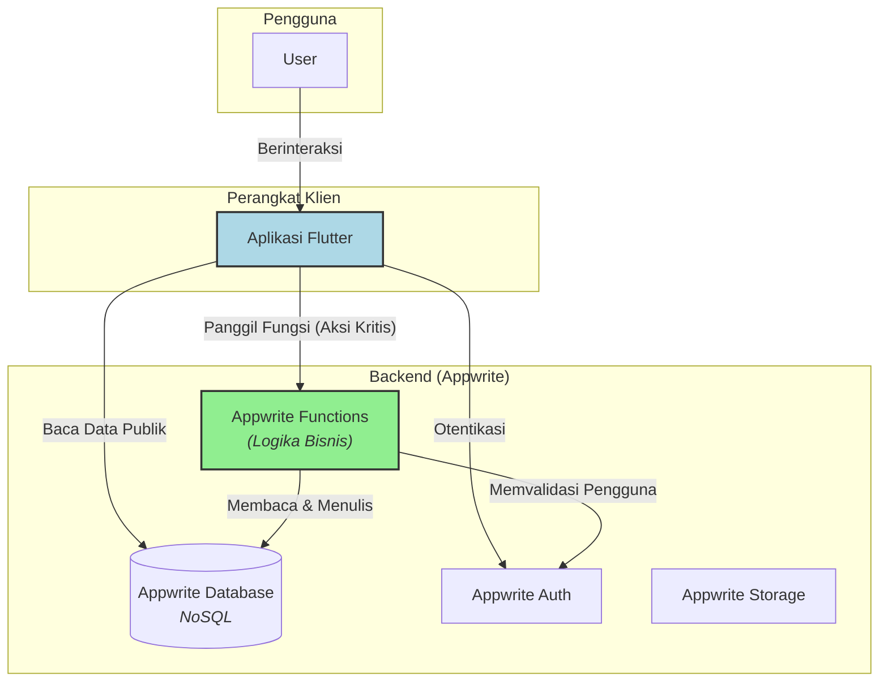
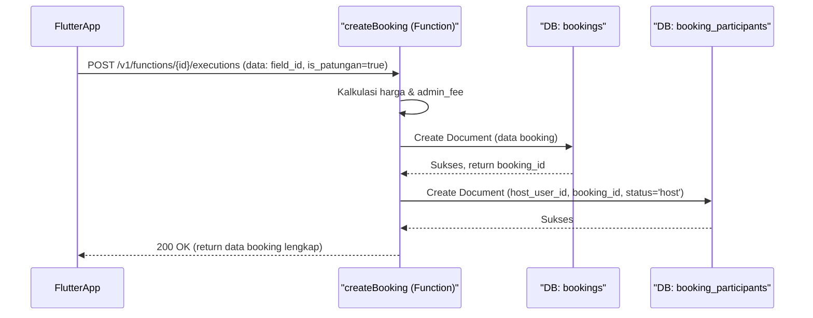
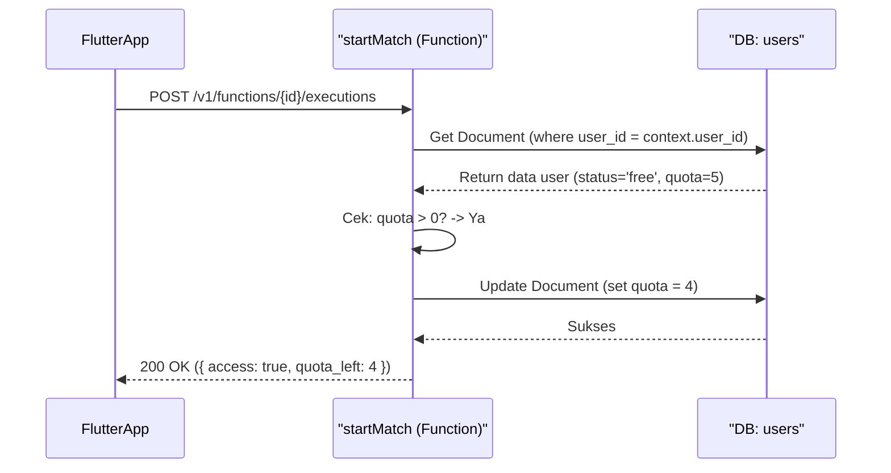

# **Software Design Document (SDD): Gsports v1.0**

| **Status Dokumen** | Draft                                        |
| ------------------ | -------------------------------------------- |
| **Versi Dokumen**  | 1.0                                          |
| **Tanggal**        | 5 November 2025                              |
| **Penyusun**       | Ahmad Rois (221240001239)<br>M. Gilang M.W. Sabd
---
*   **Nama Produk:** Gsports
*   **Tujuan:** Dokumen ini merinci desain teknis dan arsitektur perangkat lunak untuk implementasi Gsports v2.0. Dokumen ini bertujuan untuk memberikan panduan yang jelas bagi tim pengembangan tentang struktur kode, komponen utama, interaksi sistem, dan spesifikasi API, berdasarkan dokumen SRS v2.0 dan PRD v2.0.

## **1. Pendahuluan**

Dokumen ini menguraikan arsitektur sistem, desain komponen rinci, spesifikasi fungsi *serverless*, dan pertimbangan keamanan untuk Gsports v2.0. Desain ini berpusat pada arsitektur **Functions-centric** yang memanfaatkan Appwrite sebagai backend, dengan Flutter sebagai platform klien.

## **2. Arsitektur Sistem**

Arsitektur Gsports v2.0 adalah model Client-Server di mana klien (Aplikasi Flutter) berinteraksi dengan layanan backend (Appwrite) terutama melalui lapisan logika bisnis yang aman (Appwrite Functions).



**Prinsip Utama Arsitektur:**
1.  **Client sebagai Pemicu:** Aplikasi Flutter bertanggung jawab atas UI, manajemen state lokal, dan memicu operasi backend.
2.  **Functions sebagai Otak:** Semua logika bisnis yang sensitif—seperti perhitungan harga, validasi kuota, pembuatan booking, dan undangan—**wajib** dieksekusi di dalam Appwrite Functions. Ini mencegah manipulasi data dari sisi klien.
3.  **Akses Langsung Terbatas:** Klien diizinkan membaca data publik (daftar SC, jadwal) secara langsung dari database untuk efisiensi, tetapi operasi tulis (Create, Update, Delete) pada koleksi kritis harus melalui Functions.

## **3. Desain Rinci Komponen**

### **3.1. Desain Frontend (Aplikasi Flutter)**

*   **Struktur Direktori (Feature-First):**
    ```
    lib/
    ├── src/
    │   ├── core/                  # Layanan inti (API client, logger, state)
    │   │   ├── providers/         # Riverpod providers global
    │   │   └── services/          # Wrapper untuk Appwrite SDK
    │   ├── features/              # Direktori utama untuk setiap fitur
    │   │   ├── auth/              # Login, Registrasi
    │   │   ├── booking/           # Alur pemesanan, detail, patungan
    │   │   ├── discovery/         # Pencarian, detail SC, jadwal
    │   │   ├── scoreboard/        # UI Papan Skor, setup
    │   │   └── user_profile/      # Profil, Riwayat Pertandingan, Premium
    │   ├── shared/                # Widget, konstanta, model data bersama
    │   └── app.dart               # Root aplikasi & routing
    └── main.dart
    ```
*   **Manajemen State:** **Riverpod** akan digunakan sebagai solusi state management utama. Keunggulannya adalah *compile-safe*, integrasi yang baik dengan *dependency injection*, dan kemudahan dalam memisahkan logika UI dari logika bisnis.
*   **Navigasi:** **go_router** akan digunakan untuk manajemen navigasi. Ini sangat penting untuk menangani **deep linking** yang merupakan persyaratan utama untuk fitur undangan patungan (FT-204).
*   **Modul Kunci:**
    *   **`AuthModule`:** Mengelola state otentikasi (`guest` vs `authenticated`) secara global.
    *   **`DiscoveryModule`:** Menangani fetching dan penampilan data publik. Berjalan dalam mode tamu.
    *   **`BookingModule`:** Mengandung alur pemesanan, memanggil Appwrite Functions untuk kalkulasi harga dan pembuatan booking.
    *   **`PatunganModule`:** Mengelola UI untuk mengundang, melihat, dan bergabung ke booking patungan.
    *   **`ScoreboardModule`:** Mengandung UI papan skor interaktif dan logika untuk memanggil fungsi `startMatch` sebelum sesi dimulai.

### **3.2. Desain Backend (Appwrite Functions)**

Setiap fungsi akan diimplementasikan sebagai endpoint terisolasi di Appwrite.

*   **`onUserCreate` (Trigger)**
    *   **Pemicu:** `users.create` (event dari Appwrite Auth).
    *   **Logika:**
        1.  Menerima data pengguna baru (`$id`, `email`, `name`).
        2.  Membuat dokumen baru di koleksi `users` (atau `user_profiles` jika dipisah).
        3.  Mengisi dokumen dengan nilai default: `subscription_status = 'free'` dan `match_quota_remaining = 5`.
*   **`createBooking` (Eksekusi Manual)**
    *   **Logika:**
        1.  Mengambil ID pengguna yang diautentikasi dari konteks (`APPWRITE_FUNCTION_USER_ID`).
        2.  Menerima input: `{ field_id, date, time_slots, is_patungan }`.
        3.  Mengambil data `field` dari DB untuk mendapatkan `price_per_hour`.
        4.  Menghitung `base_price`, `admin_fee` (berdasarkan variabel environment), dan `final_price`.
        5.  Membuat dokumen di koleksi `bookings` dengan semua data yang dihitung.
        6.  Jika `is_patungan` adalah `true`, membuat dokumen di `booking_participants` untuk `host_user_id` dengan status `'host'`.
        7.  Mengembalikan objek booking yang baru dibuat sebagai JSON.
*   **`joinBooking` (Eksekusi Manual)**
    *   **Logika:**
        1.  Mengambil ID pengguna dari konteks.
        2.  Menerima input: `{ booking_id }`.
        3.  Memvalidasi bahwa `booking_id` ada dan bersifat patungan.
        4.  Memeriksa apakah pengguna sudah menjadi partisipan. Jika ya, kembalikan error.
        5.  Membuat dokumen baru di `booking_participants` dengan `user_id` saat ini dan status `'joined'`.
        6.  Mengembalikan status sukses.
*   **`startMatch` (Eksekusi Manual)**
    *   **Logika:**
        1.  Mengambil ID pengguna dari konteks.
        2.  Membaca dokumen pengguna dari koleksi `users`.
        3.  **If `subscription_status == 'premium'`**: Kembalikan `{ "access": true }`.
        4.  **Else (jika `'free'`)**:
            *   **If `match_quota_remaining > 0`**:
                *   Kurangi `match_quota_remaining` sebanyak 1.
                *   Update dokumen pengguna di DB.
                *   Kembalikan `{ "access": true, "quota_left": new_quota }`.
            *   **Else**: Kembalikan error `403 Forbidden` dengan kode `QUOTA_EXCEEDED`.

## **4. Spesifikasi API & Fungsi Serverless**

Ini adalah kontrak antara frontend dan backend.

| Fungsi | Metode | Input (Request Body) | Output Sukses (JSON) | Kemungkinan Error |
| :--- | :--- | :--- | :--- | :--- |
| **createBooking** | `POST` | `{ "field_id": string, "date": string, "time_slots": array, "is_patungan": boolean }` | `{ "booking_id": "...", "final_price": 157500, ... }` | `401 Unauthorized`, `404 Field Not Found`, `400 Invalid Input` |
| **joinBooking** | `POST` | `{ "booking_id": string }` | `{ "status": "success", "message": "Successfully joined" }` | `401 Unauthorized`, `404 Booking Not Found`, `409 Already a Participant`|
| **startMatch** | `POST` | `{}` (Tidak perlu body) | `{ "access": true, "quota_left": 4 }` atau `{ "access": true }` | `401 Unauthorized`, `403 Quota Exceeded` |

## **5. Diagram Alur Data (Data Flow Diagrams)**

### **Alur Data Pembuatan Booking Patungan**



### **Alur Data Pengecekan Kuota Papan Skor**



## **6. Pertimbangan Keamanan**

1.  **Otentikasi:** Semua fungsi yang dieksekusi manual akan dikonfigurasi untuk memerlukan sesi pengguna yang terotentikasi. Appwrite menangani ini secara *native*.
2.  **Otorisasi & Permissions:**
    *   **Baca Publik:** Koleksi seperti `sport_centers` dan `fields` akan memiliki izin baca `role:all`.
    *   **Baca Terproteksi:** Pengguna hanya dapat membaca data booking atau riwayat pertandingan miliknya sendiri. Ini diatur melalui *Document Level Permissions* (`user:[USER_ID]`).
    *   **Tulis Terproteksi:** Seperti yang ditekankan, semua operasi tulis kritis dilakukan oleh Functions, yang berjalan dengan API key sisi server yang memiliki hak akses lebih tinggi, sehingga klien tidak pernah memiliki izin tulis langsung ke koleksi sensitif.
3.  **Validasi Input:** Setiap Appwrite Function **wajib** melakukan validasi dan sanitasi input dari klien sebelum memprosesnya untuk mencegah *injection* atau data yang tidak valid.