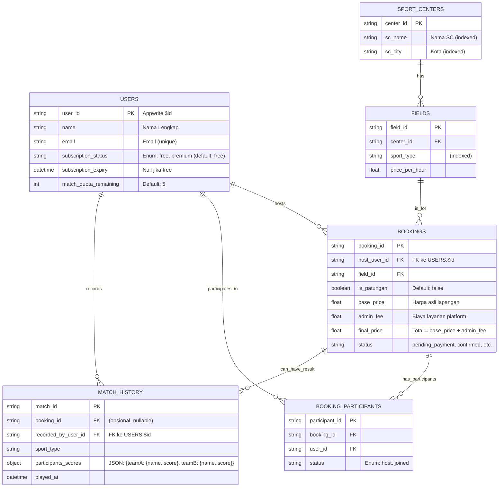

# **Software Requirements Specification (SRS)**
## **Aplikasi Komunitas & Pemesanan Lapangan Olahraga "Gsports"**

**Versi:** 1.0
**Tanggal:** 5 November 2025
| **Status Dokumen** | Draft                                        |
| ------------------ | -------------------------------------------- |
| **Versi Dokumen**  | 1.0                                          |
| **Tanggal**        | 5 November 2025                              |
| **Penyusun**       | Ahmad Rois (221240001239)<br>M. Gilang M.W. Sabdokafi (221240001248)
---

## **1. Pendahuluan**

### **1.1. Tujuan (TUJ001)**
Dokumen ini mendefinisikan kebutuhan fungsional dan non-fungsional untuk rilis Gsports versi 2.0. Versi ini bertujuan untuk mentransformasi aplikasi dari utilitas pemesanan menjadi platform komunitas olahraga yang lebih kaya fitur. Evolusi ini mencakup pengenalan **Mode Tamu (Guest Mode)** untuk eksplorasi tanpa login, mekanisme **Pemesanan Bersama (Patungan)** untuk memfasilitasi permainan grup, dan integrasi fitur **Papan Skor Digital "SEKOR"** dengan model bisnis **Freemium** untuk meningkatkan keterlibatan pengguna dan membuka aliran pendapatan baru.

### **1.2. Ruang Lingkup v2.0 (RLG001)**
Rilis v2.0 akan mencakup semua fungsionalitas dari v1.1 dan menambahkan fitur-fitur utama berikut:

*   **(F012) Mode Tamu:** Pengguna dapat menjelajahi daftar *sport center*, melihat detail lapangan, dan memeriksa ketersediaan jadwal tanpa harus mendaftar atau login.
*   **(F001 - Modifikasi) Login Saat Dibutuhkan:** Proses registrasi/login hanya akan dipicu ketika pengguna melakukan aksi yang memerlukan akun, seperti memulai pemesanan.
*   **(F013) Mekanisme Patungan:** Satu pengguna ("Host") dapat memulai pemesanan dan mengundang pengguna lain untuk bergabung. Host bertanggung jawab penuh atas pembayaran.
*   **(F014) Biaya Layanan (Admin Fee):** Setiap pemesanan akan dikenakan biaya layanan (persentase tetap) sebagai model pendapatan platform. Rincian biaya akan ditampilkan secara transparan kepada pengguna.
*   **(F015) Integrasi Papan Skor "SEKOR":** Fitur papan skor mandiri (*standalone*) dapat diakses oleh semua pengguna untuk mencatat skor pertandingan informal.
*   **(F016) Riwayat Pertandingan:** Pengguna yang login dapat menyimpan hasil pertandingan dari papan skor ke dalam riwayat pribadi mereka.
*   **(F017) Model Freemium untuk Papan Skor:** Pengguna baru mendapatkan kuota **5 kali penggunaan papan skor seumur hidup**.
*   **(F018) Alur Upgrade Premium:** Pengguna yang kehabisan kuota akan diarahkan ke halaman informasi untuk berlangganan (implementasi pembayaran penuh di luar cakupan v2.0, namun alurnya harus ada).

### **1.3. Definisi, Akronim, dan Singkatan (DEF001)**
*   **SC:** Sports Center
*   **BaaS:** Backend as a Service
*   **Host:** Pengguna yang memulai dan bertanggung jawab atas booking patungan.
*   **Peserta:** Pengguna yang diundang dan bergabung ke booking patungan.
*   **Standalone Scoreboard:** Fitur papan skor yang dapat digunakan tanpa harus terikat pada sebuah booking.

---
## **2. Deskripsi Umum & Arsitektur**

### **2.1. Perspektif Produk (DPP001)**
Gsports v2.0 adalah platform SaaS multi-tenant yang berevolusi menjadi ekosistem olahraga lengkap. Platform ini tidak hanya menghubungkan pemain dengan penyedia lapangan, tetapi juga meningkatkan pengalaman bermain itu sendiri melalui alat bantu seperti papan skor digital dan mempermudah permainan kolektif melalui fitur patungan.

### **2.2. Pengguna Target (DPT001)**
1.  **Pemain Rekreasi (Primer):** Individu atau grup yang mencari cara termudah untuk menemukan, memesan, dan mengelola permainan mereka. Mereka menghargai kemudahan dan fitur yang langsung ke intinya.
2.  **Pengguna Kasual (Baru):** Individu yang tertarik pada olahraga dan mungkin awalnya hanya menggunakan fitur gratis seperti papan skor sebelum akhirnya menjadi pengguna aktif pemesanan.
3.  **Admin Sports Center (Sekunder):** Tetap menjadi pengguna kunci yang mendapatkan alat untuk mengelola operasional mereka.

### **2.3. Teknologi & Arsitektur yang Direkomendasikan (TEK001)**
Tumpukan teknologi inti tetap sama (Flutter + Appwrite), namun arsitektur akan sangat bergantung pada logika sisi server untuk memastikan keamanan dan integritas data.

*   **Frontend (Aplikasi Mobile):** Flutter (Dart)
*   **Backend (BaaS):** Appwrite (Self-hosted atau Cloud)
*   **Arsitektur Inti: Functions-Centric**
    *   Logika bisnis kritis **HARUS** dieksekusi melalui **Appwrite Functions** (ditulis dalam Dart, Node.js, dll.). Klien (Flutter) hanya bertindak sebagai pemicu dan penampil data.
    *   **Fungsi Kunci yang Direncanakan:**
        *   `createBooking`: Menangani pembuatan booking, kalkulasi `base_price` + `admin_fee`, dan pembuatan entri partisipan untuk Host.
        *   `inviteToBooking`: Membuat undangan untuk pengguna lain agar bisa bergabung ke booking patungan.
        *   `joinBooking`: Memproses permintaan pengguna untuk bergabung ke sebuah booking.
        *   `onUserCreate` (Trigger): Menginisialisasi data pengguna baru (misal: kuota papan skor).
        *   `startMatch`: Memvalidasi kuota/status premium pengguna sebelum mengizinkan penggunaan papan skor dan mengurangi kuota jika perlu.
        *   `updateUserSubscription` (Webhook Target): Menerima panggilan dari sistem pembayaran (misal: RevenueCat) untuk memperbarui status langganan pengguna.

---
## **3. Kebutuhan Fungsional (Revisi & Tambahan)**

*(Fitur F002-F004, F006-F011 dari v1.1 tetap berlaku dengan modifikasi utama pada aturan akses/permissions)*

### **3.1. Fitur: Alur Pengguna & Pemesanan**

**3.1.1. (F012) Mode Tamu & Login Saat Dibutuhkan**
*   **ID Fitur:** F012
*   **Peran:** Pengguna Baru (Tamu), Pengguna Terdaftar
*   **User Story:**
    *   "Sebagai pengguna baru, saya ingin bisa langsung menjelajahi aplikasi, melihat lapangan dan jadwal yang tersedia tanpa harus membuat akun terlebih dahulu."
    *   "Sebagai pengguna tamu, ketika saya mencoba memesan lapangan, saya ingin aplikasi dengan jelas meminta saya untuk login atau mendaftar agar saya dapat melanjutkan."
*   **Alur Sistem:**
    ```mermaid
    sequenceDiagram
        participant U as Pengguna (Tamu)
        participant App as Aplikasi Flutter
        participant API as Appwrite API

        U->>App: Buka Aplikasi
        App->>API: Request `listDocuments` (sport_centers, fields, etc.)
        Note over API: Permissions Read: role:all
        API-->>App: Data publik
        App->>U: Tampilkan daftar SC, lapangan, jadwal

        U->>App: Pilih slot & tekan "Pesan Sekarang"
        App->>App: Cek Status Otentikasi -> Guest
        App->>U: Tampilkan Layar Login/Registrasi
        U->>App: Login/Daftar
        App->>API: `createEmailSession()` / `createAccount()`
        API-->>App: Sesi & Data Pengguna
        App->>App: Simpan sesi, alihkan ke Alur Pemesanan
        App->>U: Lanjutkan proses pemesanan sebagai user ter-login
    ```
*   **Kriteria Penerimaan:**
    1.  Pengguna dapat mengakses fitur pencarian, detail SC, dan detail lapangan tanpa login.
    2.  Tombol "Pesan" memicu alur otentikasi jika pengguna belum login.
    3.  Setelah login berhasil, pengguna dikembalikan ke alur pemesanan.

**3.1.2. (F014) Biaya Layanan (Admin Fee)**
*   **ID Fitur:** F014
*   **Peran:** Pemain (Host)
*   **User Story:** "Sebagai pengguna, sebelum saya mengkonfirmasi pemesanan, saya ingin melihat rincian harga yang jelas, termasuk harga sewa asli dan biaya layanan platform, agar saya tahu persis berapa yang harus saya bayar."
*   **Kriteria Penerimaan:**
    1.  Di halaman konfirmasi pemesanan, UI menampilkan rincian: `Harga Sewa`, `Biaya Layanan`, dan `Total Pembayaran`.
    2.  Biaya layanan dihitung sebagai persentase tetap dari harga sewa dasar.
    3.  Perhitungan ini dilakukan di sisi server melalui Appwrite Function untuk mencegah manipulasi.

**3.1.3. (F013) Mekanisme Patungan (Host Membayar)**
*   **ID Fitur:** F013
*   **Peran:** Pemain (Host & Peserta)
*   **User Story:**
    *   "Sebagai Host, setelah memesan lapangan, saya ingin bisa membagikan tautan undangan agar teman-teman saya bisa bergabung dan nama mereka tercatat dalam pemesanan."
    *   "Sebagai Peserta, setelah menerima undangan, saya ingin bisa dengan mudah bergabung ke dalam sesi permainan."
*   **Alur Sistem (Undangan & Bergabung):**
    ```mermaid
    sequenceDiagram
        participant Host as Host
        participant App as Aplikasi Flutter
        participant API as Appwrite Functions
        participant Friend as Teman

        Host->>App: Selesaikan pemesanan, masuk ke Detail Booking
        App->>Host: Tampilkan tombol "Undang Teman"
        Host->>App: Tekan "Undang Teman"
        App->>App: Generate unique link (e.g., gsports://booking/BOOKING_ID)
        Host->>Friend: Bagikan link via WhatsApp, dll.

        Friend->>App: Buka link (Deep Link)
        App->>App: Arahkan ke detail booking
        App->>Friend: Tampilkan info booking & tombol "Gabung"

        Friend->>App: Tekan "Gabung"
        App->>API: Panggil `joinBooking(bookingId)`
        API-->>App: Sukses
        App->>Friend: UI diperbarui (status menjadi "Bergabung")
    ```
*   **Kriteria Penerimaan:**
    1.  Pada halaman detail booking, Host melihat opsi untuk mengundang peserta.
    2.  Aplikasi dapat men-generate tautan unik (deep link) untuk setiap booking.
    3.  Pengguna lain yang membuka tautan dapat melihat detail booking dan bergabung.
    4.  Daftar peserta yang telah bergabung terlihat di halaman detail booking.
    5.  Host bertanggung jawab 100% atas pembayaran di muka.

### **3.2. Fitur: Integrasi Papan Skor "SEKOR"**

**3.2.1. (F015 & F016) Papan Skor Standalone & Riwayat**
*   **ID Fitur:** F015, F016
*   **Peran:** Semua Pengguna
*   **User Story:**
    *   "Sebagai pemain, saya ingin bisa dengan cepat membuka papan skor dari menu utama untuk mencatat skor pertandingan dadakan saya, bahkan jika saya tidak memesan lapangan melalui aplikasi."
    *   "Sebagai pengguna yang login, setelah pertandingan selesai, saya ingin menyimpan hasilnya ke dalam riwayat akun saya untuk dilihat kembali."
*   **Kriteria Penerimaan:**
    1.  Terdapat akses yang jelas ke fitur Papan Skor dari navigasi utama aplikasi.
    2.  Pengguna (termasuk Tamu) dapat menggunakan fungsionalitas papan skor.
    3.  Opsi untuk "Simpan Hasil" hanya muncul dan berfungsi untuk pengguna yang sudah login.
    4.  Hasil yang tersimpan muncul di halaman "Riwayat Pertandingan" pengguna.

**3.2.2. (F017 & F018) Model Freemium & Alur Upgrade**
*   **ID Fitur:** F017, F018
*   **Peran:** Pengguna Gratis (Free User)
*   **User Story:** "Sebagai pengguna baru, saya ingin mencoba fitur papan skor beberapa kali secara gratis. Jika saya merasa fitur ini berguna dan kuota saya habis, saya ingin tahu bagaimana cara untuk terus menggunakannya."
*   **Alur Sistem (Validasi Kuota):**
    ```mermaid
    sequenceDiagram
        participant U as Pengguna (Login, Free)
        participant App as Aplikasi Flutter
        participant API as Appwrite Function (`startMatch`)

        U->>App: Buka Papan Skor & setup pertandingan
        U->>App: Tekan "Mulai Pertandingan"
        App->>API: Panggil `startMatch(sportType)`
        API->>API: Cek `users` collection: `subscription_status` & `match_quota_remaining`
        alt Kuota Tersedia ( > 0 )
            API->>API: Kurangi `match_quota_remaining` -= 1
            API-->>App: Respons Sukses
            App->>U: Buka UI Papan Skor Interaktif
        else Kuota Habis ( <= 0 )
            API-->>App: Respons Error (Quota Exceeded)
            App->>U: Tampilkan dialog/layar "Kuota Habis. Upgrade ke Premium!"
        end
    ```
*   **Kriteria Penerimaan:**
    1.  Setiap pengguna baru secara otomatis mendapatkan 5 kuota penggunaan papan skor.
    2.  Setiap penggunaan papan skor (yang disimpan) oleh pengguna gratis akan mengurangi kuota.
    3.  Saat kuota habis, pengguna tidak dapat memulai/menyimpan pertandingan baru dan akan ditampilkan pesan untuk upgrade.
    4.  Pesan tersebut mengarahkan pengguna ke halaman statis yang menjelaskan keuntungan versi Premium.

---
## **4. Kebutuhan Non-Fungsional (KNF)**
*(Semua KNF dari v1.1 tetap berlaku. Tambahan:)*

*   **KNF011: Integritas Transaksional (Transactional Integrity)**
    *   **KNF011.1:** Operasi yang mengubah data kritis (pembuatan booking, pengurangan kuota) harus bersifat *atomic* atau mendekati. Logika ini wajib ditempatkan di Appwrite Functions untuk mencegah *race conditions* dan data yang tidak konsisten.
*   **KNF012: Pengalaman Pengguna (UX)**
    *   **KNF012.1:** Transisi dari mode tamu ke mode terotentikasi harus mulus tanpa kehilangan konteks (misal: pengguna harus kembali ke alur pemesanan yang mereka mulai).
    *   **KNF012.2:** Tampilan rincian biaya harus transparan dan mudah dipahami.
*   **KNF013: Keamanan (Security)**
    *   **KNF013.1:** Semua logika bisnis yang menyangkut uang (kalkulasi biaya) dan kuota (manajemen langganan) harus divalidasi dan dieksekusi di sisi server (Appwrite Functions). Klien tidak boleh dipercaya untuk mengirim data final.

---
## **5. Skema Database Detail (Appwrite Collections) v2.0 (DB001)**



### **Detail Collection & Permissions**

*   **`users`**
    *   **Atribut Baru:** `subscription_status`, `subscription_expiry`, `match_quota_remaining`.
    *   **Permissions:**
        *   Read: `user:$id` (Pengguna hanya bisa baca data sendiri).
        *   Update: `user:$id` (Hanya untuk data non-kritis seperti nama). Update data langganan HANYA melalui Appwrite Function.
*   **`sport_centers`, `fields`**
    *   **Permissions:**
        *   Read: `role:all` (Dapat dibaca oleh siapa saja, termasuk tamu).
        *   Create/Update: `role:super_admin`, `team:sc_[centerId]_admins`.
*   **`bookings`**
    *   **Atribut Baru:** `host_user_id`, `is_patungan`, `base_price`, `admin_fee`, `final_price`.
    *   **Permissions:**
        *   Read: `user:[host_user_id]`, `team:[center_id]_admins`, dan (melalui query) pengguna dalam `booking_participants`.
        *   Create: `role:member` (Hanya pengguna terotentikasi, melalui Appwrite Function).
        *   Update: `team:[center_id]_admins`.
*   **`booking_participants` (Baru)**
    *   **Tujuan:** Melacak semua pengguna yang terlibat dalam satu booking patungan.
    *   **Permissions:**
        *   Read: Pengguna yang `booking_id`-nya sama.
        *   Create/Update: Hanya melalui Appwrite Function (`inviteToBooking`, `joinBooking`).
*   **`match_history` (Baru)**
    *   **Tujuan:** Menyimpan catatan pertandingan yang dimainkan melalui papan skor.
    *   **Atribut:** `booking_id` bersifat opsional untuk mendukung papan skor standalone.
    *   **Permissions:**
        *   Read/Delete: `user:[recorded_by_user_id]`.
        *   Create: `role:member`.

---

*Dokumen ini bersifat hidup dan akan menjadi dasar untuk pengembangan Gsports v2.0.*
